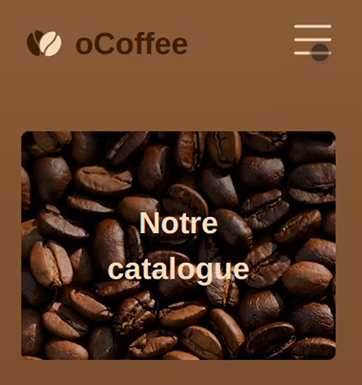
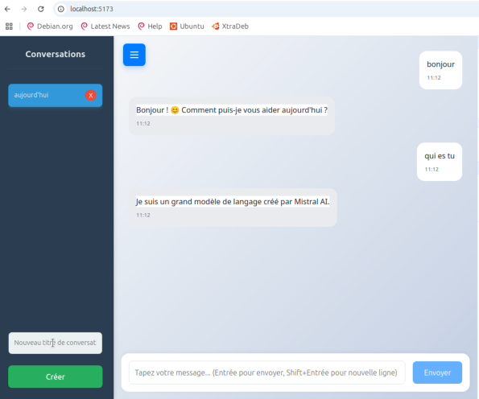

#

## Salut! 👋

Je suis **Ludovic**, développeur web et mobile français. Je suis toujours avide d'apprendre et de collaborer avec les autres pour créer des solutions efficaces.

## A propos de moi    

Après 23 ans dans l'industrie automobile, j'ai choisi de me reconvertir en développement web pour donner une nouvelle orientation à ma carrière. Formé chez O'clock, j'ai acquis de solides compétences en HTML, CSS, JavaScript, Node.js et Git. Curieux, rigoureux et orienté solutions.

[contactez moi](#Contactez-moi)  

## Compétences et technologies 

  
  
  
  
  
  
  

## Meilleurs projets

|   O'coffee      |    O'chat     |
| ------ | ------|
|  |  |

## Statistiques GitHub

 

## Activité récente

Je n'ai actuellement aucune activité enregistrée sur GitHub, mais j'ai hâte de m'engager davantage avec la communauté !

## Contactez moi

 

---

 
 

